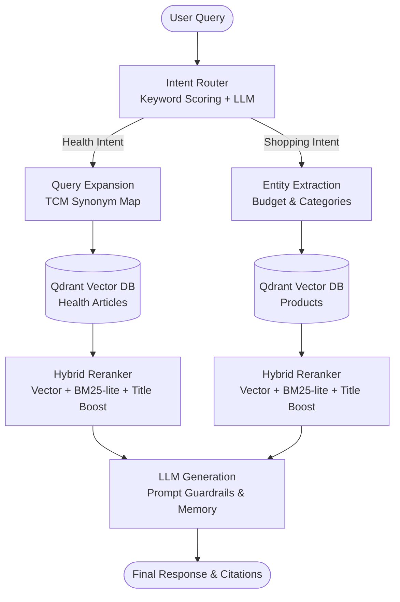

# Hệ thống Oriental Herbs: E-Commerce & RAG Chatbot

Repository này chứa mã nguồn cho nền tảng thương mại điện tử Oriental Herbs và dịch vụ chatbot Retrieval-Augmented Generation (RAG) được tích hợp bên trong hệ thống.

## AI Service (RAG Chatbot)

AI Service hoạt động như một microservice độc lập trong kiến trúc hệ thống, cung cấp tính năng tư vấn chuyên sâu trong lĩnh vực Y học cổ truyền (Đông y).

### Kiến trúc RAG Tổng quát



### Năng lực hệ thống
- **Xây dựng kho tri thức:** Tự động thu thập (crawl) và xử lý dữ liệu từ nhiều nguồn y học cổ truyền có cấu trúc website khác nhau; chuẩn hóa hàng nghìn tài liệu y khoa và thông tin sản phẩm.
- **Data Ingestion Pipeline:** Thiết lập luồng xử lý dữ liệu tự động bao gồm parsing, phân chia đoạn (chunking) theo ngữ cảnh y khoa, embedding và lưu trữ trên Qdrant với các metadata đa chiều phục vụ mục đích truy xuất.
- **Xử lý Vocabulary Gap:** Giải quyết khoảng cách ngữ nghĩa giữa truy vấn của người dùng và thuật ngữ Đông y chuyên ngành bằng cách xây dựng synonym map từ hơn 400 sản phẩm và áp dụng kỹ thuật query-side expansion trước khi truy xuất.
- **Chiến lược Hybrid Retrieval:** Kết hợp phương pháp tìm kiếm theo ngữ nghĩa (vector similarity) và tìm kiếm từ khóa (custom BM25-lite), đồng thời tích hợp bước reranking để tối ưu độ chính xác tuyệt đối cho các kết quả trả về.
- **Intent Routing:** Thiết kế hệ thống định tuyến (intent router) để phân loại và điều hướng các truy vấn của người dùng về sản phẩm, dược liệu, sức khỏe và dinh dưỡng sang các luồng xử lý chuyên biệt.
- **Prompt Guardrails:** Áp dụng các giới hạn an toàn (guardrails) nghiêm ngặt nhằm ngăn chặn chatbot đưa ra các chẩn đoán hoặc khuyến nghị y tế vượt quá phạm vi cho phép.

### Công nghệ sử dụng
- **Core Frameworks:** Python, FastAPI, Uvicorn
- **Vector Database:** Qdrant
- **LLM & Embedding:** Google Generative AI API, `bkai-foundation-models/vietnamese-bi-encoder` (Sentence-Transformers)
- **Reranking:** Custom Hybrid Score (BM25-lite + Semantic + Title Boost)
- **Data Ingestion:** Requests, BeautifulSoup4, Markdownify

---

## Nền tảng E-Commerce

Hệ thống quản lý toàn bộ quy trình bán lẻ dược liệu với các tính năng chuyên biệt.

### Các Module cốt lõi
- **Quản lý Sản phẩm & Danh mục:** Quản lý sản phẩm phân cấp với các cấu trúc biến thể (variant) phức tạp.
- **Shopping & Checkout:** Quản lý giỏ hàng và tự động tính toán chi phí vận chuyển.
- **Quản lý Đơn hàng & Hoàn trả:** Theo dõi vòng đời đơn hàng và xử lý các yêu cầu đổi/trả.
- **Dynamic Homepage:** Cho phép quản trị viên tùy biến giao diện trang chủ thông qua thao tác kéo thả (drag-and-drop) từ admin dashboard.
- **Chiến dịch Marketing:** Vận hành tự động các chiến dịch giảm giá và mã khuyến mãi.
- **Phân tích Khách hàng:** Lập hồ sơ sức khỏe người dùng và trực quan hóa qua biểu đồ radar trong giao diện quản trị.

### Công nghệ sử dụng
- **Backend:** Java 17, Spring Boot (JPA, Security, Web), PostgreSQL
- **Frontend:** Next.js (App Router), TypeScript, Tailwind CSS
- **Authentication:** JWT, OAuth2 (Google Login)
- **Infrastructure:** Docker, Cloudinary (Image Hosting)

---

## Hướng dẫn Triển khai (Local Deployment)

Toàn bộ hệ thống có thể được khởi chạy thông qua Docker Compose. Yêu cầu Docker Desktop đang hoạt động.

```bash
docker-compose up --build -d
```

### Các dịch vụ khả dụng
- **Backend (Spring Boot):** `http://localhost:8080`
- **Frontend User:** `http://localhost:3000`
- **Frontend Admin:** `http://localhost:3001`
- **AI Service (FastAPI):** `http://localhost:8000` (Giao tiếp nội bộ backend)
- **Qdrant (Vector DB):** `http://localhost:6333`

*Lưu ý: Các biến môi trường (`.env`) cần được cấu hình dựa trên các file mẫu `.env.example` trong từng thư mục dịch vụ tương ứng trước khi tiến hành build.*
